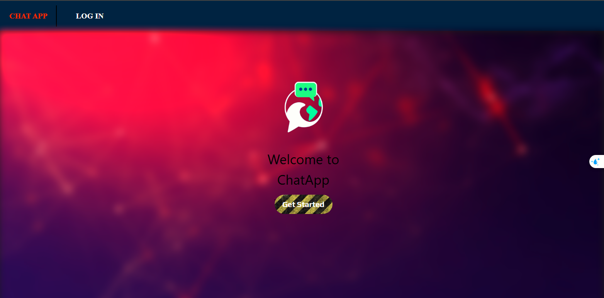
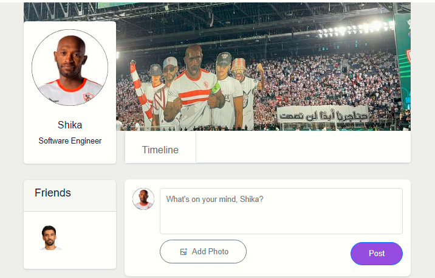
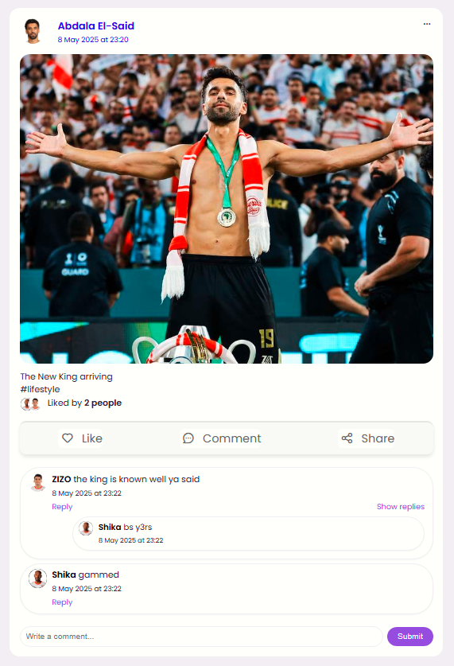
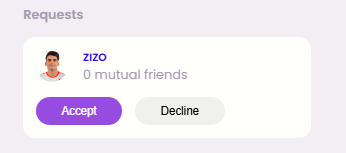

# 🧑‍💻 Social Site App


A dynamic full-stack social media app where users can connect, post, chat in real time, and manage their profiles securely. Built with **Node.js**, **Express**, and **MongoDB** — this project showcases backend development, real-time interactions, authentication, and more.

---

## 🔗 Live Demo  
[👉 View Live](https://your-live-demo-url.com) <!-- Replace this with actual link once deployed -->

---

## 🖼️ Screenshots

<div align="center">
  
  
  
<!--   
  
   -->
  
</div>

---

## ⚙️ Features

- 🔐 **Authentication**
  - Register, login, forgot/reset password
  - Google OAuth2 sign-in
  - JWT & session-based security

- 👤 **User Profiles**
  - Change profile & cover images
  - Edit personal information

- 📝 **Posts & Feeds**
  - Create posts with images
  - Like, comment, reply, delete, and share posts

- 💬 **Real-Time Chat**
  - Private and group chat rooms
  - Built using Socket.IO

- 🔔 **Real-Time Notifications**
  - Instant alerts for friend requests, likes, and messages

- 📩 **Friendship System**
  - Send/accept/reject friend requests
  - Mutual friend detection

- 📧 **Email System**
  - Send password reset links via Nodemailer

---

## 🛠️ Tech Stack

| Area         | Tools/Technologies                                   |
|--------------|------------------------------------------------------|
| Backend      | Node.js, Express.js                                  |
| Database     | MongoDB, Mongoose                                    |
| Real-time    | Socket.IO                                            |
| Auth         | JWT, bcrypt, express-session, Google OAuth2          |
| Email        | Nodemailer                                           |
| Uploads      | Multer                                               |
| Validation   | express-validator                                    |
| Frontend     | HTML, CSS, Bootstrap, JavaScript (Vanilla)           |

---

## 🔄 Installation & Setup

1. **Clone the repository:**  
   ```bash
   git clone https://github.com/HadyHashiam/SocialMediaApplication.git
   cd SocialMediaApplication
   ```

2. **Backend Setup:**  
   - Create a `.env` file and add the following:
     ```env
     PORT=your_port
     JWT_SECRET_KEY=your_secret
     JWT_EXPIRE_TIME=1d
     MONGO_URI=your_mongodb_connection_string
     CLOUDINARY_CLOUD_NAME=your_cloud_name
     CLOUDINARY_API_KEY=your_key
     CLOUDINARY_API_SECRET=your_secret
     EMAIL_HOST=smtp.gmail.com
     EMAIL_PORT=your_email_port
     EMAIL_USER=your_email
     EMAIL_PASSWORD=your_email_password
     SESSION_SECRET=your_session_secret
     BASE_URL=http://localhost:3000
     GOOGLE_CLIENT_ID=your_google_client_id
     GOOGLE_CLIENT_SECRET=your_google_client_secret
     GOOGLE_CALLBACK_URL=http://localhost:3000/auth/google/callback
     success_url=http://localhost:3000/success
     cancel_url=http://localhost:3000/cancel
     ```
   - Run the server:
     ```bash
     node server.js
     ```

---

## 💡 Notes

1. ** Make sure** MongoDB is running locally or update the connection URI in the .env.
2. **You can** use services like Cloudinary for image upload.
3. **You can** replace the email configuration with services like SendGrid if preferred.

---

---

## 📅 Contributing

Contributions are welcome! Please fork the repository and submit a pull request.

1. Fork the repo.
2. Create a new branch:
   ```bash
   git checkout -b feature/YourFeature
   ```
3. Commit your changes:
   ```bash
   git commit -m "Add your feature"
   ```
4. Push to the branch:
   ```bash
   git push origin feature/YourFeature
   ```
5. Open a pull request.

---

## 👥 Contact

For any inquiries or support:

**Hady Hashim Abd El-Azim**  
Junior Backend Developer  
Email: [Hadyhashim17@gmail.com]  
GitHub: [https://github.com/HadyHashiam](https://github.com/HadyHashiam)  
LinkedIn: [https://www.linkedin.com/in/hady-hashim-09a9a022a/](https://www.linkedin.com/in/hady-hashim-09a9a022a/)
